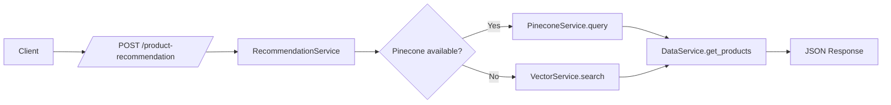

# Module 1: Data Preparation and Backend Setup

- Title Page
  - Module: 1 — Data Preparation and Backend Setup
  - Team Members: Nicholas
  - Submission Date: 2025-12-09

- Introduction
  - Objective: Prepare a clean dataset, build vector representations, select similarity metrics, and expose a product recommendation API.
  - Importance: Establishes the foundation for search, recommendations, and downstream modules.

- High-Level Flow
  - Description: Clean dataset → build TF‑IDF vectors → optionally upsert to Pinecone → serve recommendations via Flask.
  - Diagram:

- Key Decisions
  - Use TF‑IDF for lightweight vectorization; Pinecone optional for scalable vector search.
  - Default similarity: cosine; dot product supported for experimentation.
  - Bad query safeguards to avoid nonsensical inputs and potential misuse.

- Challenges and Solutions
  - Handling absent Pinecone API key: graceful fallback to local TF‑IDF search.
  - Ensuring clean text fields: trim and fill before duplicate removal for better canonicalization.

- Conclusion
  - The module delivers a robust baseline recommendation service, ready for integration with OCR and CNN modules.

- References
  - Data cleaning: `services/data_service.py:27-33`, `services/data_service.py:12-26`, `services/data_service.py:33-34`
  - Vectorization & metrics: `services/vector_service.py:9-13`, `services/vector_service.py:14-19`, `services/vector_service.py:21-25`
  - Pinecone integration: `services/pinecone_service.py:6-18`, `services/pinecone_service.py:20-31`, `services/pinecone_service.py:33-42`
  - Endpoint: `app.py:29-55`, initialization `app.py:18-27`
