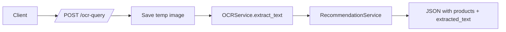
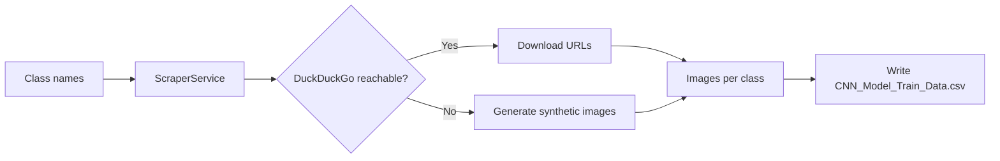

# Module 2: OCR and Web Scraping

- Title Page
  - Module: 2 — OCR and Web Scraping
  - Team Members: Nicholas
  - Submission Date: 2025-12-09

- Introduction
  - Objective: Implement OCR text extraction from images and prepare product image datasets via scraping for CNN training.
  - Importance: Enables handwriting/image-based query inputs and provides training data for the image model.

- High-Level Flow
  - Description: OCR extracts text from uploaded images → text goes through the same recommendation pipeline; scraper builds a labeled image dataset.
  - Diagram (OCR):

  - Diagram (Scraper):

- Key Decisions
  - Lazy-load PIL and pytesseract; use `TESSERACT_CMD` if set; return empty text on errors to keep endpoint reliable.
  - Resilient scraping with synthetic images when external fetch is blocked; ensures CNN can be trained in constrained environments.

- Challenges and Solutions
  - MemoryError at import: moved to lazy import with try/except in OCR service.
  - DuckDuckGo token and network failures: wrapped logic; generated placeholders via Pillow to guarantee dataset availability.

- Conclusion
  - OCR endpoint works with graceful fallback; scraper produces labeled datasets or synthetic images, making the pipeline robust.

- References
  - OCR service: `services/ocr_service.py:7-14`, `services/ocr_service.py:16-25`
  - Scraper: `services/scraper_service.py:13-36`, `services/scraper_service.py:38-67`, `services/scraper_service.py:69-80`
  - Endpoint: `app.py:57-73`
