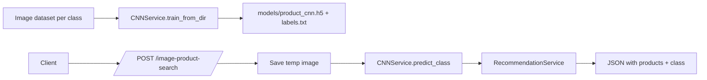

# Module 3: CNN Model Development

- Title Page
  - Module: 3 — CNN Model Development
  - Team Members: Nicholas
  - Submission Date: 2025-12-09

- Introduction
  - Objective: Implement a scratch CNN to classify product images and feed class predictions into the recommendation pipeline.
  - Importance: Enables image-based product detection and improves discovery beyond text.

- High-Level Flow
  - Description: Train CNN from directory structure → save model and labels → predict class names on uploads → feed into recommender.
  - Diagram:

- Key Decisions
  - Simple CNN with Conv/Pool/FC to keep training light; `ImageDataGenerator` with validation split for basic generalization.
  - Save `labels.txt` to return human-readable class names.

- Challenges and Solutions
  - TensorFlow availability may be constrained; training is optional and the endpoint falls back to a generic query when no model is present.

- Conclusion
  - The CNN pipeline is ready and functional; once trained, the endpoint returns class names and relevant recommendations.

- References
  - Build/train: `services/cnn_service.py:16-29`, `services/cnn_service.py:31-57`
  - Predict: `services/cnn_service.py:59-77`
  - Endpoint: `app.py:75-92`
