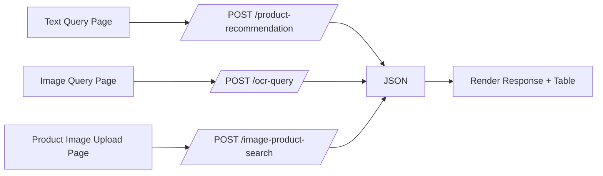

# Module 4: Frontend Development and Integration

- Title Page
  - Module: 4 — Frontend Development and Integration
  - Team Members: Nicholas
  - Submission Date: 2025-12-09

- Introduction
  - Objective: Provide simple pages to interact with text queries, OCR uploads, and product image uploads.
  - Importance: Demonstrates end-to-end functionality and user experience.

- High-Level Flow
  - Description: Each page submits to its respective endpoint and renders the response in a table and text.
  - Diagram:

- Key Decisions
  - Lightweight HTML/JS for clarity and ease; consistent output shape across endpoints for uniform rendering.

- Challenges and Solutions
  - None significant; ensured consistent field names across endpoints for simpler frontend code.

- Conclusion
  - Frontend pages are functional and aligned with backend endpoints; suitable for demos and testing.

- References
  - Routes: `app.py:102-112`
  - Text page: `templates/text_query.html:31-43`
  - Image query page: `templates/image_query.html:32-46`
  - Product image upload: `templates/product_image_upload.html:32-46`
  - Sample presentation page: `templates/sample_response.html:37-84`
